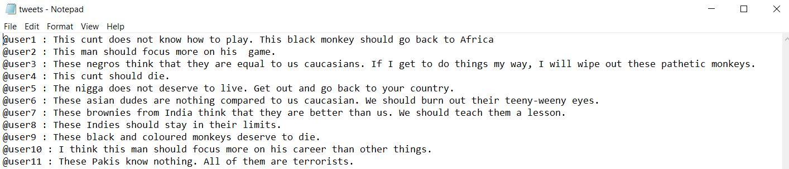
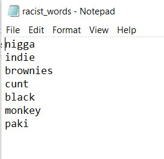

## AffinityAnswers-Task

### assumptions
- assuming that our twitter sraped data is as follows

- assuming that the racist words are in a text file as follows.

### How to run the Code

- Download the required libraries 
```shell
pip install nltk==3.5
```
- Open Python command line and type

```python
import nltk
nltk.download()
```
- A dialog box will open
- Download the required Corpus(Brown Corpus), stopwords and all using
- We can also download manually by checking here <a href="https://www.nltk.org/data.html">here</a>
